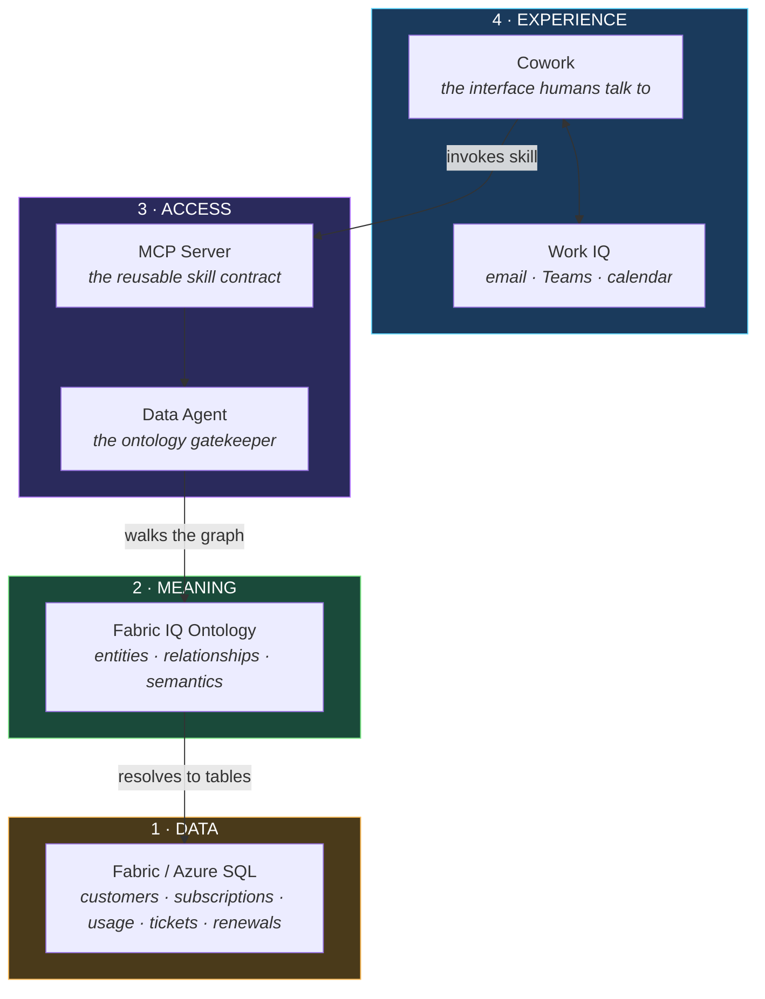
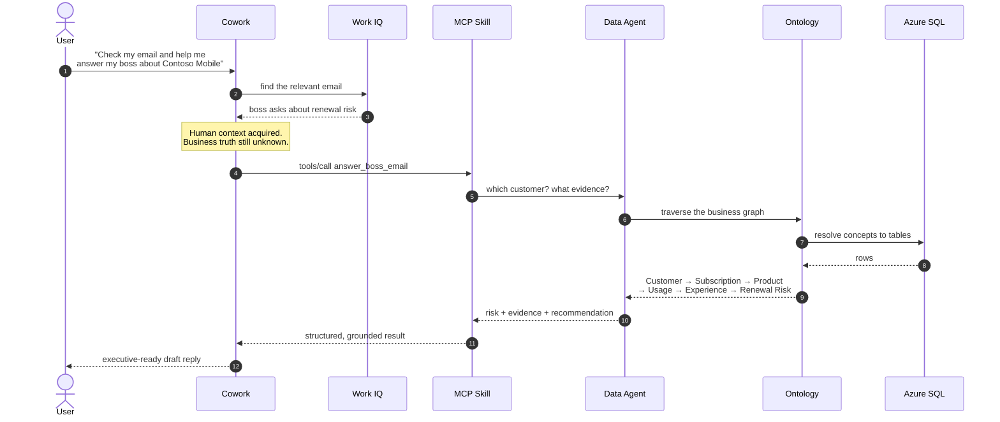
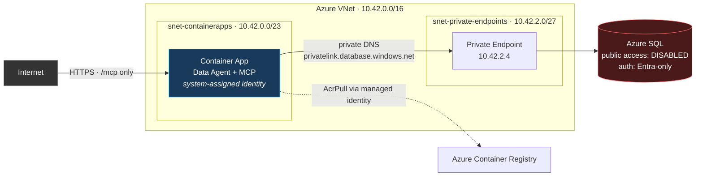
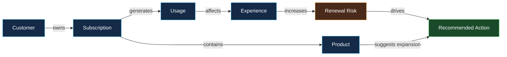

# Fabric + Cowork: the Ontology Layer Demo

**How an ontology layer turns Microsoft Fabric into business memory, and Cowork into the interface people actually talk to.**

This repository is a working, deployed reference implementation. It is meant to be shown, not just read.

---

## Table of contents

- [The one-sentence idea](#the-one-sentence-idea)
- [WHY — the problem this solves](#why--the-problem-this-solves)
- [WHAT — the four layers](#what--the-four-layers)
- [HOW — the architecture](#how--the-architecture)
- [The demo scenario](#the-demo-scenario)
- [The ontology in this demo](#the-ontology-in-this-demo)
- [Running the demo](#running-the-demo)
- [Deploying it yourself](#deploying-it-yourself)
- [Security model](#security-model)
- [Talk track for a live demo](#talk-track-for-a-live-demo)
- [FAQ](#faq)

---

## The one-sentence idea

> An AI agent that can query your database is a reporting tool.
> An AI agent that can **reason over your business model** is a colleague.
> The ontology layer is the difference.

---

## WHY — the problem this solves

### The situation everyone recognizes

Your boss sends an email:

> *"Can you quickly tell me which enterprise customers are at risk this quarter, and what we should do about Contoso Mobile?"*

Answering that seems simple. It isn't. To answer it properly you must know:

| You need to know | Which lives in |
|---|---|
| Who Contoso Mobile is, and how big they are | CRM / customer master |
| What they bought and what it's worth | Subscriptions / billing |
| Whether they're actually using it | Usage telemetry |
| Whether they're having a bad experience | Support tickets, SLA, NPS |
| When the contract renews | Contracts |
| What "at risk" even *means* at our company | **Nowhere. It's in someone's head.** |

That last row is the real problem. The data exists. The **meaning** doesn't.

### Why "just point an LLM at the database" fails

Teams try this, and it breaks in predictable ways:

| Failure | What actually happens |
|---|---|
| **No shared meaning** | The model sees a table called `sub_arr_v2`. Is that annual recurring revenue? Monthly? Gross or net? It guesses. |
| **No relationships** | It doesn't know that a support ticket is *connected* to a renewal. So it answers the question you asked, not the question you meant. |
| **No governance** | To be useful it needs broad table access. Now your AI has SELECT on everything. |
| **No explainability** | You get a number with no lineage. An executive asks "where did that come from?" and nobody can say. |
| **Every agent re-invents it** | The next team builds the same joins again, slightly differently, and gets a different number. |

The result is an AI that is *confidently wrong*, which is worse than no AI at all.

### What the ontology layer changes

An ontology is a **shared, explicit, machine-readable model of your business**. It declares:

- The **entities** that matter — Customer, Subscription, Product, Usage, Experience, Renewal Risk
- The **relationships** between them — a Customer *owns* Subscriptions; Experience *increases* Renewal Risk
- The **semantics** — which physical columns actually mean "revenue exposure"

Once that exists, the AI stops guessing:

| Without ontology | With ontology |
|---|---|
| "Find tables that might relate to customers" | "Traverse `Customer -> Subscription -> Product`" |
| Answer is a number | Answer is a number **with a path** |
| Governance = table permissions | Governance = which ontology concepts an agent may traverse |
| Each agent re-derives logic | Logic is defined once, reused by every agent |
| "Trust me" | "Here's the chain of reasoning" |

**The ontology is where your business logic stops being tribal knowledge and becomes infrastructure.**

---

## WHAT — the four layers

This demo has exactly four layers. Each one earns its place.



### Layer 1 — Data

Ordinary business tables. Nothing special, and that's the point: **you don't have to restructure your data to adopt an ontology.**

### Layer 2 — Meaning (the ontology)

A semantic model that sits *above* the tables and declares what they mean and how they connect. This is the layer most architectures are missing.

### Layer 3 — Access (the Data Agent + MCP)

The **Data Agent** is the gatekeeper. Agents don't get database credentials; they get a small set of business-level questions they're allowed to ask. The agent decides how to traverse the graph and what evidence to return.

**MCP (Model Context Protocol)** wraps that agent in an open, standard contract — so *any* AI client can consume it. Build once, reuse everywhere.

### Layer 4 — Experience (Cowork + Work IQ)

Cowork is where the human is. **Work IQ** supplies the human context (the email, the meeting, the thread). The MCP skill supplies the business truth. Cowork composes them into one answer.

> **This is the punchline of the demo:**
> Work IQ knows *what your boss asked*.
> Fabric IQ knows *what's true about the business*.
> Cowork is the only place those two meet.

---

## HOW — the architecture

### What actually happens when you ask a question



Notice step 9: the Data Agent returns a **path**, not just a number. That path is why the answer is defensible.

### Deployed topology



**The database has no internet exposure.** Only the Data Agent / MCP layer is reachable. That is the architectural expression of "gatekeeper".

---

## The demo scenario

**NovaTel Enterprise** — a fictional telco with enterprise customers on 5G, IoT, and roaming products.

The live prompt:

> *"Check my email and see how I should answer my boss about Contoso Mobile."*

What Cowork produces:

> Contoso Mobile is at **high renewal risk**. The ontology path
> `Customer → Subscription → Product → Usage → Experience → Renewal Risk`
> shows **$2.4M ARR** exposed, **38%** data-usage growth, **3** open support tickets,
> **2** SLA breaches, and **NPS 19**, with renewal on **2026-11-01** in Negotiation stage.
>
> Recommended: schedule an executive service review, commit a recovery plan for open SLA items,
> and position Premium SLA Care before renewal negotiations.

### Why this scenario is persuasive

The insight is **not retrievable from any single table**. It only exists as a *path*:

```
Usage grew 38%          →  the customer is leaning on us more
  ↓
Dropped calls rose      →  and our service got worse as they leaned in
  ↓
SLA breaches + escalation →  they noticed, and they escalated
  ↓
NPS 19, renewal in 45 days →  and they can act on it very soon
  ↓
$2.4M ARR at risk       →  this is a board-level number
```

A SQL query gives you one of those rows. **The ontology gives you the story.**

---

## The ontology in this demo



### Entities and their physical mapping

| Ontology entity | Table | What it means to the business |
|---|---|---|
| Customer | `customers` | Who we serve, and how strategic they are |
| Subscription | `subscriptions` | The commercial relationship and its value |
| Product | `products` | What they bought, and its margin profile |
| Usage | `usage_metrics` | Whether they actually consume it |
| Experience | `support_tickets` | Whether we're delivering well |
| Renewal Risk | `renewals` | When the relationship is up for decision |
| Recommended Action | *derived* | What we should do about it |

### Semantic mappings

These are the definitions that stop the AI from guessing:

| Business concept | Resolves to |
|---|---|
| Revenue Exposure | `subscriptions.arr_usd` + `renewals.renewal_date` + `renewals.stage` |
| Experience Health | `support_tickets.severity` + `.status` + `.sla_breached` |
| Consumption Trend | `usage_metrics.data_tb` + `.roaming_gb` over `.month` |

---

## Running the demo

### The web UI

Open the deployed app. You get the ontology graph rendered live, a prompt box, and the Data Agent's grounded answer.

### Through Cowork

Register the MCP endpoint in `~/.copilot/mcp-config.json`:

```json
{
  "mcpServers": {
    "fabric-ontology-agent": {
      "type": "http",
      "url": "https://<your-app>.azurecontainerapps.io/mcp",
      "tools": ["*"]
    }
  }
}
```

Then just ask Cowork in natural language:

> *"Check my email and see how I should answer my boss about Contoso Mobile."*

### Calling the MCP server directly

```bash
# Discover the tools
curl -X POST https://<your-app>.azurecontainerapps.io/mcp \
  -H "content-type: application/json" \
  -d '{"jsonrpc":"2.0","id":1,"method":"tools/list"}'

# Ask the gatekeeper a business question
curl -X POST https://<your-app>.azurecontainerapps.io/mcp \
  -H "content-type: application/json" \
  -d '{"jsonrpc":"2.0","id":2,"method":"tools/call",
       "params":{"name":"customer_risk_brief",
                 "arguments":{"customerName":"Contoso Mobile"}}}'
```

### The tool contract

| Tool | Purpose |
|---|---|
| `describe_ontology` | Return entities, relationships, and semantic mappings |
| `list_customers` | Discover which customers exist |
| `customer_risk_brief` | Full renewal-risk brief, with ontology path and evidence |
| `answer_boss_email` | Take email text, pick the customer, draft an executive reply |

Note how **narrow** this is. Four business questions — not "run arbitrary SQL". That narrowness *is* the governance.

### Local development

```powershell
npm install
npm start     # http://localhost:3000
```

With no SQL environment variables set, the app runs on in-memory sample data, so you can demo it on a plane.

---

## Deploying it yourself

```powershell
az login
.\scripts\deploy-azure.ps1
```

The script is idempotent and provisions:

1. VNet with a delegated Container Apps subnet and a private-endpoint subnet
2. Azure SQL with **public network access disabled** and **Entra-only authentication**
3. Private endpoint + private DNS zone so the SQL hostname resolves privately
4. Azure Container Registry, with the image built in the cloud
5. VNet-injected Container Apps environment
6. The Data Agent container app with a system-assigned managed identity, granted Entra admin on SQL

Tables are created and seeded automatically on first boot.

---

## Security model

| Concern | How it's handled |
|---|---|
| Database exposure | `publicNetworkAccess = Disabled`. Reachable only via private endpoint inside the VNet. |
| Credentials | **None.** Entra-only auth with a system-assigned managed identity. No passwords in config, code, or CI. |
| Registry credentials | **None.** Image pulled via the same managed identity with `AcrPull`. |
| DNS integrity | Private DNS zone `privatelink.database.windows.net` keeps the original hostname, so TLS validation still works. |
| Agent blast radius | Agents get four business tools — not table access. The Data Agent owns every query. |
| Auditability | Every answer carries its ontology path, so any number can be traced to its derivation. |

> **The security story and the ontology story are the same story.** The gatekeeper pattern is what makes both possible: agents ask business questions, the Data Agent decides how to answer them, and the database is never directly exposed.

---

## Talk track for a live demo

**~8 minutes.**

| # | Beat | What you say / do |
|---|---|---|
| 1 | **The pain** *(1 min)* | Read the boss email out loud. Ask the room: how long would this take you today? Usual answer: hours, across four systems. |
| 2 | **The naive fix** *(1 min)* | "We could point an LLM at the database." Then show why: no meaning, no relationships, no governance, no lineage. |
| 3 | **The ontology** *(2 min)* | Show the graph. Walk one edge out loud: *"Experience increases Renewal Risk"* — that sentence is now something software can execute. |
| 4 | **The gatekeeper** *(1 min)* | Call `describe_ontology`, then `customer_risk_brief`. Point at the returned `ontologyPath`. "The answer comes with its reasoning." |
| 5 | **The skill** *(1 min)* | Show `mcp-config.json`. "One endpoint. Any agent. This is build-once-reuse-everywhere." |
| 6 | **The payoff** *(2 min)* | In Cowork: *"Check my email and see how I should answer my boss about Contoso Mobile."* Let it read the email, call the skill, and compose the reply. |

**Close on this line:**

> *"Work IQ knew what my boss asked. Fabric IQ knew what was true. Cowork was the only place those two could meet — and the ontology is what let them speak the same language."*

---

## FAQ

**Is this Fabric IQ itself?**
No. This is a reference implementation of the *pattern* — ontology → Data Agent → MCP → Cowork — deployed on Azure SQL so anyone can run it end to end. The architecture maps directly onto Fabric IQ semantic models and Fabric Data Agents.

**Why Azure SQL instead of a Fabric SQL database?**
Portability. The demo has to deploy into any Azure subscription in one script. The ontology, the gatekeeper contract, and the Cowork integration are unchanged if you swap the storage layer.

**Why does the database have no public access?**
Because a gatekeeper that can be bypassed isn't a gatekeeper. If agents could reach the database directly, every governance claim in this README would be decorative.

**Why MCP instead of a REST API?**
MCP is an open standard for tool use. A REST API needs a custom integration per client. An MCP server is discoverable and consumable by any compatible agent — including Cowork — with no bespoke glue.

**Can I add my own ontology?**
Yes. Edit `src/ontology.js` to declare your entities, edges, and semantic mappings, then extend the Data Agent in `src/dataAgent.js` with the traversals you want to expose. The MCP layer and the Cowork integration need no changes.

---

## Repository layout

```
src/
  ontology.js     the semantic model: entities, edges, mappings
  dataAgent.js    the gatekeeper: graph traversal and reasoning
  mcp.js          MCP protocol surface (JSON-RPC 2.0)
  db.js           schema, seed data, Entra-authenticated SQL access
  server.js       HTTP host for the UI, the API, and /mcp
public/           the ontology graph visualization
scripts/
  deploy-azure.ps1  idempotent private-by-default Azure deployment
Dockerfile        container image for Azure Container Apps
```

---

*Fictional company, fictional data. The architecture is real.*
