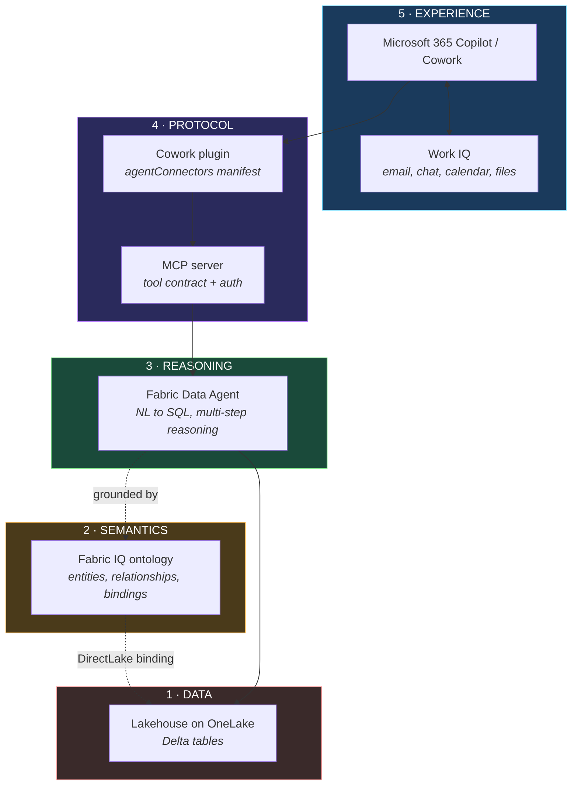
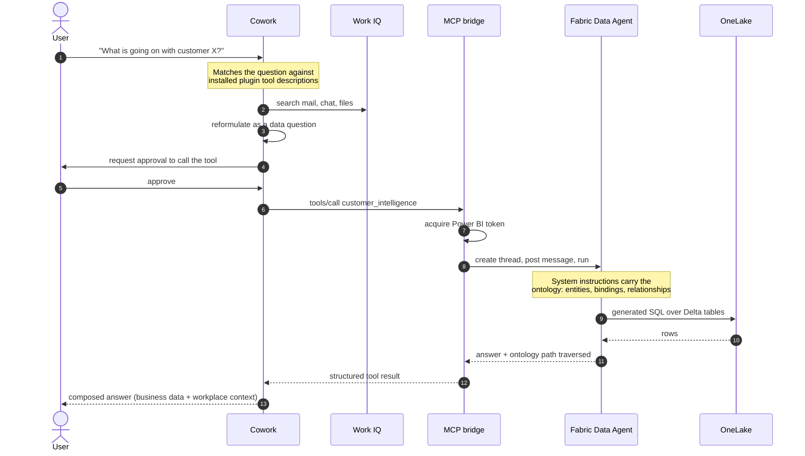
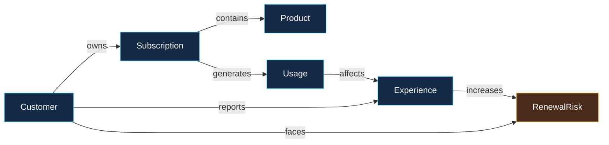

# Ontology-Grounded Agent Pattern: Microsoft Fabric → MCP → Microsoft 365 Copilot

A working implementation of a pattern that lets an AI assistant answer business questions
using governed enterprise data, where the semantics of that data are defined once in an
ontology rather than re-derived by every agent that touches it.

This repository documents what was built, how each component works, what the platform
constraints are, and where the boundaries of the current implementation lie.

---

## Contents

- [Problem statement](#problem-statement)
- [The pattern](#the-pattern)
- [Request lifecycle](#request-lifecycle)
- [Components](#components)
  - [1. Data layer — Lakehouse on OneLake](#1-data-layer--lakehouse-on-onelake)
  - [2. Semantic layer — Fabric IQ ontology](#2-semantic-layer--fabric-iq-ontology)
  - [3. Reasoning layer — Fabric Data Agent](#3-reasoning-layer--fabric-data-agent)
  - [4. Protocol layer — MCP bridge](#4-protocol-layer--mcp-bridge)
  - [5. Experience layer — Cowork plugin](#5-experience-layer--cowork-plugin)
- [Platform constraints found](#platform-constraints-found)
- [Repository layout](#repository-layout)
- [Deploying](#deploying)
- [Security model](#security-model)
- [Performance](#performance)
- [Sample domain](#sample-domain)

---

## Problem statement

Answering a question like *"what is the renewal risk for this customer?"* requires joining
several datasets — contracts, usage telemetry, support tickets, sentiment — and knowing how
they relate. The data usually exists. What does not exist in machine-readable form is the
**meaning**: which column represents revenue exposure, that a support ticket is causally
connected to a renewal, that consumption growth combined with SLA breaches is a different
signal than either one alone.

Pointing a language model directly at a database leaves that meaning undefined. The model
infers relationships from column names and foreign keys. That inference is often plausible
and occasionally wrong, and it is re-derived independently by every agent that connects to
the same database.

An ontology moves that meaning out of inference and into declared, versioned infrastructure.

| Concern | Direct database access | Ontology-grounded access |
|---|---|---|
| Entity meaning | Inferred from schema | Declared, with descriptions |
| Relationships | Guessed from keys | Declared, with verbs and direction |
| Derived concepts | Re-invented per agent | Defined once |
| Traceability | Answer only | Answer plus traversal path |
| Governance boundary | Table permissions | Which concepts an agent may traverse |

---

## The pattern

Five layers, each with one responsibility.



The separation matters because each layer can be replaced independently. The ontology does
not know about MCP. The MCP server does not know about Cowork. The Data Agent does not know
who is calling it.

---

## Request lifecycle

What happens when a user types a question, with no explicit tool invocation.



Two things are worth noting.

**Step 2 is automatic.** Cowork selects the tool by matching intent against the plugin's
declared description. No `@mention` and no slash command.

**Step 14 combines two sources.** The business figures come from Fabric; the workplace
context comes from Work IQ. In testing, when no email traffic existed for the customer, the
assistant said so explicitly rather than implying it had checked nothing.

---

## Components

### 1. Data layer — Lakehouse on OneLake

Six Delta tables representing a telecommunications business. Nothing about them is special:
the pattern does not require restructuring existing data.

| Table | Grain |
|---|---|
| `customers` | one row per account |
| `products` | one row per commercial offer |
| `subscriptions` | customer × product, with seats and ARR |
| `usage_metrics` | customer × month, consumption and network quality |
| `support_tickets` | one row per ticket, with severity and SLA breach flag |
| `renewals` | one row per customer, with date, stage and NPS |

Loaded through the OneLake DFS API and the Lakehouse `tables/{name}/load` endpoint.
See [`scripts/generate-sample-data.js`](scripts/generate-sample-data.js) and
[`scripts/load-lakehouse.ps1`](scripts/load-lakehouse.ps1).

### 2. Semantic layer — Fabric IQ ontology

An `Ontology` item in Fabric. Creating one provisions three companion items automatically:
an Eventhouse, a KQL database, and a GraphModel.

Its definition is **TMDL**, retrieved and updated through
`POST /v1/workspaces/{ws}/ontologies/{id}/getDefinition` and `updateDefinition`.

> The public REST documentation describes the ontology definition as JSON with
> `EntityTypes/{id}/definition.json` files. The live API returns TMDL. The structure below was
> established empirically and is what the service actually accepts. Exported files are in
> [`ontology/tmdl/`](ontology/tmdl).

The definition separates physical binding from business semantics:

```
tables/{Name}.tmdl              physical: columns, types, key, DirectLake partition
entities/{Name}.tmdl            semantic: entity declaration + backingTable pointer
entityRelationships.tmdl        the graph: fromEntity, toEntity, verb
model.tmdl                      manifest: ref table / ref entity / ref namespace
namespaces/default.tmdl         namespace declaration
expressions.tmdl                DirectLake connection to the Lakehouse
```

A physical table, bound to OneLake through DirectLake:

```tmdl
table Customer
	lineageTag: <guid>

	column customer_id
		isKey: true
		dataType: int64
		sourceColumn: customer_id

	column customer_name
		dataType: string
		sourceColumn: customer_name

	partition Customer = entity
		mode: directLake
		source
			entityName: customers
			expressionSource: 'DirectLake - <LakehouseName>'
```

A business entity, which is a distinct object from the table that feeds it:

```tmdl
/// A NovaTel enterprise account. The commercial subject the whole ontology hangs from.
entity Customer
	lineageTag: <guid>
	backingTable: Customer
```

A relationship, carrying a verb and a direction:

```tmdl
/// Consumption growth and network quality affect the support experience.
entityRelationship affects
	label: affects
	lineageTag: <guid>
	fromEntity: Usage
	toEntity: Experience
```

That `entity` / `table` separation is the core idea. `Customer` is a business concept an
agent can reason about without knowing that a table named `customers` exists.

The graph declared in this repository:



Scripts: [`ontology/build-ontology-graph.ps1`](ontology/build-ontology-graph.ps1),
[`ontology/set-entity-keys.ps1`](ontology/set-entity-keys.ps1).

### 3. Reasoning layer — Fabric Data Agent

A first-class Fabric item (`DataAgent`). It converts natural-language questions into SQL over
its attached data sources and performs multi-step reasoning.

**Attaching data sources through the SDK requires the full tree path.** This is the single
most consequential detail in the implementation:

```python
ds.select("Schemas", "dbo", "Tables", "customers")   # correct
ds.select("dbo", "customers")                        # silently wrong
```

The short form marks the table's *columns* as selected but leaves the table node itself at
`is_selected: false`. The backend validates the table node, so requests fail with
`No tables were found in the configured Lakehouse data source` even though every column is
selected. The UI's table picker exhibited the same behaviour.

**Ontology grounding.** The ontology cannot be attached as a data source — the backend
returns:

```
errorCode: OntologyAddAsDataSourceBlocked
"Ontologies can no longer be added as a data source.
 Add the ontology through the ontologies surface instead."
```

The approach used here reads the ontology's TMDL definition through the Fabric API, derives a
semantic briefing from it (entities, their physical tables, properties, keys, relationships
with descriptions), and writes it to the agent's `aiInstructions`:

```python
agent.update_settings(ai_instructions=briefing)
agent.publish_staging(description=..., to_m365=True)
```

The briefing is generated from the live ontology, not hand-written. Re-running the notebook
after changing the ontology re-synchronises the agent.

With grounding in place, answers begin with the traversal:

```
Ontology path: Customer -owns-> Subscription -generates-> Usage
               -affects-> Experience -increases-> RenewalRisk
```

**Scope of this technique.** This is semantic grounding derived from the ontology. It is not
native traversal of the materialised graph — see
[platform constraints](#platform-constraints-found).

The agent runs in a Fabric notebook; see
[`scripts/run-fabric-notebook.mjs`](scripts/run-fabric-notebook.mjs), which creates a notebook
from a local Python file, executes it as a job, and reads results back from OneLake.

`publish_staging(to_m365=True)` publishes the agent to Microsoft 365, where it appears as a
declarative agent in the Copilot agent store and is invocable with `@AgentName`.

### 4. Protocol layer — MCP bridge

An MCP server that exposes the Data Agent as tools. It exists because Cowork's plugin model
consumes MCP servers, and because the Data Agent's endpoint requires specific headers that a
generic client will not send.

**The endpoint.** The Data Agent is reachable outside Fabric through a capacity-scoped
workload host that speaks the OpenAI Assistants protocol:

```
https://{workload-host}/webapi/capacities/{capacityId}
  /workloads/ML/AISkill/Automatic/v1
  /workspaces/{workspaceId}/artifacts/{artifactId}
  /aiassistant/openai
?api-version=2024-05-01-preview
```

Required headers, established by intercepting the SDK's own HTTP traffic:

| Header | Value |
|---|---|
| `Authorization` | `Bearer {Power BI token}` |
| `OpenAI-Beta` | `assistants=v2` |
| `ActivityId` | fresh GUID per request |
| `x-ms-workload-resource-moniker` | GUID, stable per session |
| `x-ms-ai-assistant-scenario` | `aiskill` |
| `x-ms-ai-aiskill-stage` | `sandbox` or `production` |
| `X-Taxonomy-TrafficType` | `Production` |
| `x-llm-service-tier` | `default` |

The token audience is `https://analysis.windows.net/powerbi/api` — an ordinary Power BI
token, obtainable outside the Fabric runtime.

Flow: `POST /assistants` → `POST /threads` → `POST /threads/{id}/messages` →
`POST /threads/{id}/runs` → poll → `GET /threads/{id}/messages`.

Implementation: [`mcp-bridge/src/fabricAgent.js`](mcp-bridge/src/fabricAgent.js).
Standalone client for testing: [`scripts/call-data-agent.mjs`](scripts/call-data-agent.mjs).

**Tool contract.** Two tools, deliberately narrow:

| Tool | Purpose |
|---|---|
| `customer_intelligence` | Natural-language question about a customer account |
| `describe_ontology` | Entities, tables and relationships, for explaining the model |

The narrowness is the governance boundary. Callers ask business questions; they cannot run
arbitrary SQL. The Data Agent owns query generation.

**Authentication.** [`mcp-bridge/src/auth.js`](mcp-bridge/src/auth.js) resolves a token in
order of preference:

1. **Service principal** (client credentials) — for production. Requires the tenant setting
   *Service principals can use Fabric APIs*.
2. **Refresh token** — works without an app registration. Rotates itself on each redemption
   and caches the access token in memory.
3. **Static token** — development only; expires in roughly an hour.

### 5. Experience layer — Cowork plugin

Cowork (inside the Microsoft 365 Copilot app) has three extension surfaces under
**Customize**:

| Surface | Contains | Registered via |
|---|---|---|
| **Plugins** | MCP servers | `.zip` or folder upload |
| **Skills** | instructions (`SKILL.md`) | OneDrive folder |
| Preferences | behaviour settings | UI |

**A plugin is required here, not a skill.** Cowork's code-execution sandbox has no outbound
network access — verified directly, with the agent reporting
*"There's no outbound network in this container"*. Instructions alone therefore cannot reach
an external service. Capabilities that call out must arrive as MCP tools through a plugin.

The package is a Microsoft 365 unified app manifest with a root `agentConnectors` array:

```json
{
  "$schema": "https://developer.microsoft.com/json-schemas/teams/v1.27/MicrosoftTeams.schema.json",
  "manifestVersion": "1.27",
  "agentConnectors": [
    {
      "id": "novatel-customer-intelligence",
      "displayName": "NovaTel Customer Intelligence",
      "description": "Use this connector for any question about a named customer account, renewal risk, churn, revenue exposure, ARR, subscriptions, product usage, consumption trends, support tickets, SLA breaches, NPS or account health. Customers include ...",
      "toolSource": {
        "remoteMcpServer": {
          "mcpServerUrl": "https://<host>/mcp",
          "authorization": { "type": "None" },
          "mcpToolDescription": { "file": "toolDescription.json" }
        }
      }
    }
  ]
}
```

Package contents — four files at the archive root:

```
plugin.zip
├── manifest.json          agentConnectors with one remoteMcpServer
├── color.png              192×192
├── outline.png            32×32, transparent
└── toolDescription.json   mirrors the server's tools/list response
```

Two validation rules cost time to discover:

- `packageName` must be **absent**. The schema rejects additional properties.
- `remoteMcpServer` requires `mcpToolDescription.file`; `mcpServerUrl` alone is not accepted.

**The connector description drives routing.** Cowork matches user intent against it. During
testing the assistant's reasoning was visible:

> *"There's a novatel-customer-intelligence MCP server that seems like the likely tool for
> this — I'll search for it, and also check M365."*

Descriptions should name the entities, the question types, and the specific proper nouns the
tool knows about.

Package: [`mcp-bridge/plugin/`](mcp-bridge/plugin). Icon generator:
[`mcp-bridge/make-icons.mjs`](mcp-bridge/make-icons.mjs).

---

## Platform constraints found

Documented so others do not repeat the investigation. All were observed directly against the
live service in September 2026; all involve preview features.

**The ontology cannot be a Data Agent data source.** The backend returns
`OntologyAddAsDataSourceBlocked` with the message that ontologies "can no longer be added" —
wording that indicates a deliberate change. Attaching the companion GraphModel instead fails
with `Failed to fetch schema for the data source`, because the graph was never projected.

**Graph projection does not recognise entity keys.** The projection wizard reports
`No primary key` for every entity while the entity configuration page, reading the same
model, displays the key correctly with a key icon. Consequences: the graph is not
materialised, so nothing can traverse it natively.

Attempts made:
- `isKey: true` written to the column through the API — accepted, displayed by the UI, ignored
  by projection.
- The UI's own *Define entity type key* dialog — closes without error, persists nothing.
  Console shows a failed request to `.../definition/scripts`.
- Nine alternative key properties on the `entity` object (`keyProperty`, `primaryKey`,
  `entityKey`, `entityIdParts`, `idProperty`, `identifier`, `key`, `keyColumn`, `keyColumns`)
  — all rejected by the TMDL parser with
  `Unsupported property ... in the current context`.
- A complete rebuild through the UI wizard rather than the API — identical result.

**Data Agent chat is blocked by a modal loop under automation.** Submitting a question raises
*"Standard runtime supports up to 25 tables"*; dismissing it discards the message, and it
reappears on the next attempt even after switching to the Preview runtime. The Python SDK
path is unaffected and is what this implementation uses.

**Fabric capacity administration rejects federated (`#EXT#`) identities.** With Owner rights
on the Azure subscription, the capacity resource can be created, paused and deleted, but
assigning a capacity administrator fails:

```
BadRequest, subCode 14: "Invalid principal name"
```

The Azure portal sends the same PATCH and receives the same error, so this is not an API-only
limitation. A service principal is accepted as capacity administrator, but then the Fabric
APIs reject it with `Unauthorized` unless the tenant setting *Service principals can use
Fabric APIs* is enabled.

The distinction: **Azure RBAC governs the capacity resource; Entra directory roles govern
Fabric itself.** Subscription ownership does not confer Fabric administration.

**Dependency conflict in the Fabric notebook runtime.** The bundled `typing_extensions` is
too old for the `openai` package, so `FabricOpenAI` fails to import with
`cannot import name 'Sentinel'`. Fix: `pip install -U typing_extensions>=4.14` before any
heavy imports.

---

## Repository layout

```
ontology/
  tmdl/                      ontology definition exported from the live service
  build-ontology-graph.ps1   writes entities and relationships via updateDefinition
  set-entity-keys.ps1        sets isKey on identity columns

mcp-bridge/
  src/fabricAgent.js         Data Agent client: endpoint, headers, run lifecycle
  src/auth.js                token resolution: SP, refresh token, static
  src/server.js              MCP server: tool contract, JSON-RPC surface
  plugin/                    Cowork plugin package (manifest, icons, tool description)
  make-icons.mjs             generates the PNG icons without external dependencies
  Dockerfile

reference-app/               self-contained illustration of the pattern
  src/ontology.js            the same graph as declarative JavaScript
  src/dataAgent.js           gatekeeper logic and traversal
  src/mcp.js                 MCP surface
  src/db.js                  schema, seed data, Entra-authenticated SQL
  public/                    renders the ontology graph in the browser

scripts/
  generate-sample-data.js    builds the CSV sample dataset
  load-lakehouse.ps1         uploads to OneLake and loads Delta tables
  run-fabric-notebook.mjs    runs a local Python file as a Fabric notebook job
  call-data-agent.mjs        calls the Data Agent directly, for testing
  deploy-azure.ps1           provisions the Azure-hosted reference app
```

`reference-app/` is an independent illustration: the same ontology and gatekeeper logic
expressed in JavaScript over Azure SQL, with a browser visualisation of the graph. It runs
without any Fabric dependency and is useful for understanding the pattern in isolation.

---

## Deploying

### Prerequisites

- Fabric capacity, and a workspace assigned to it
- Azure subscription for hosting the MCP bridge
- Microsoft 365 Copilot with Cowork

### Sequence

**1. Data**

```bash
node scripts/generate-sample-data.js
pwsh scripts/load-lakehouse.ps1     # set workspace and lakehouse ids first
```

**2. Ontology** — create an `Ontology` item, then:

```powershell
pwsh ontology/build-ontology-graph.ps1
pwsh ontology/set-entity-keys.ps1
```

**3. Data Agent** — create a `DataAgent` item, then run a notebook that attaches the
Lakehouse with full-path `select()` calls, derives the briefing from the ontology TMDL, writes
it to `ai_instructions`, and calls `publish_staging(to_m365=True)`. Use
[`scripts/run-fabric-notebook.mjs`](scripts/run-fabric-notebook.mjs) to execute it.

**4. MCP bridge**

```bash
cd mcp-bridge
az acr build --registry <acr> --image novatel-mcp:v1 --file Dockerfile .
az containerapp create -g <rg> -n novatel-mcp --environment <env> \
  --image <acr>.azurecr.io/novatel-mcp:v1 \
  --ingress external --target-port 8080 --system-assigned
```

Environment variables:

| Variable | Purpose |
|---|---|
| `FABRIC_HOST` | capacity workload host |
| `FABRIC_CAPACITY_ID` | capacity GUID |
| `FABRIC_WORKSPACE_ID` | workspace GUID |
| `FABRIC_ARTIFACT_ID` | Data Agent item GUID |
| `FABRIC_STAGE` | `sandbox` or `production` |
| `AAD_TENANT_ID` + `AAD_CLIENT_ID` + `AAD_CLIENT_SECRET` | service principal auth |
| `AAD_TENANT_ID` + `FABRIC_REFRESH_TOKEN` | refresh-token auth |
| `FABRIC_STATIC_TOKEN` | development only |

**5. Plugin**

```powershell
cd mcp-bridge
node make-icons.mjs
# set mcpServerUrl and validDomains in plugin/manifest.json
Compress-Archive -Path plugin/* -DestinationPath plugin.zip -Force
```

Cowork → Customize → Plugins → Add plugin → upload → Publish. Confirm the toggle is enabled.

---

## Security model

| Concern | Handling |
|---|---|
| Database exposure | The reference app's Azure SQL has `publicNetworkAccess = Disabled`, reachable only through a private endpoint inside the VNet |
| Database credentials | None. Entra-only authentication with a system-assigned managed identity |
| Registry credentials | None. Images pulled with the same managed identity and an `AcrPull` assignment |
| Fabric credentials | Never stored in the image. Supplied as environment variables; service principal and refresh token modes rotate automatically |
| Caller blast radius | Two business tools, not SQL access. The Data Agent owns query generation |
| Traceability | Answers carry the ontology path, so figures can be traced to their derivation |

No tenant identifiers, endpoints, or credentials are committed. Environment-specific values
appear as placeholders.

---

## Performance

Measured against the deployed bridge, three consecutive calls:

| Call | Latency |
|---|---|
| First (creates assistant) | 15.7 s |
| Second | 13.9 s |
| Third | 13.6 s |

Roughly 13 seconds is the Data Agent reasoning and querying. Bridge overhead is under a
second.

Optimisations applied:

- **Assistant caching.** Assistants are stateless and reusable; creating one per question
  cost a round-trip for no benefit.
- **Parallel setup.** Assistant resolution and thread creation run concurrently.
- **Adaptive polling.** Backoff from 1 s to 5 s instead of a fixed 4 s interval. A run
  finishing at 9 s was previously not observed until 12 s.

End-to-end latency in Cowork is higher, since Cowork performs its own reasoning and queries
Work IQ in the same turn.

---

## Sample domain

A fictional telecommunications operator, NovaTel Enterprise, with three enterprise accounts.
The data is synthetic and shaped so that renewal risk is not visible in any single table —
it only emerges from the traversal:

```
Usage grew 38%                      the customer depends on the service more
  ↓ affects
Dropped-call rate rose 1.8% → 3.1%  service quality degraded as they leaned in
  ↓ increases
3 open tickets, 2 SLA breaches      they noticed and escalated
  ↓
NPS 19, renewal in 45 days          they can act on it soon
  ↓
$2.4M ARR exposed                   the commercial consequence
```

A single-table query returns one of those rows. The traversal produces the causal chain.

---

*Fictional company and synthetic data. The architecture, APIs and constraints are real and
were verified against the live services.*
